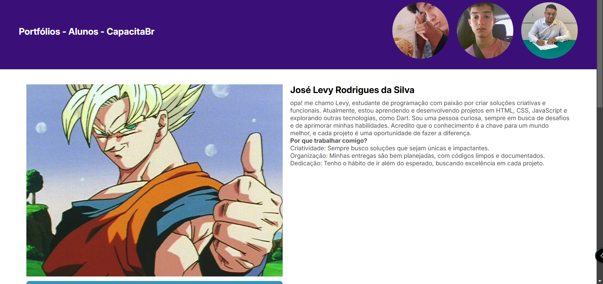

# Portfólio CapacitaBr  
[🌐 Acesse o portfólio](https://daviiisousa.github.io/Portifolio-CapacitaBr/html/index)

## 👨‍💻 Desenvolvedores  
- **Davi**  
- **Levy**  
- **Ataslan**

## 📝 Sobre  
Este projeto foi desenvolvido durante o curso de **FullStack do Instituto Atlântico**. O objetivo era criar portfólios pessoais utilizando **HTML** e **CSS** para aplicar os conhecimentos adquiridos.

## 🎯 Objetivo  
Criar um portfólio que apresente nossas habilidades técnicas e que seja uma base para projetos futuros.

## 🚀 Funcionalidades    
- Seções personalizadas para apresentar projetos e contatos.  
- Links para redes sociais.  

## 🛠️ Tecnologias  
- **HTML5:** Estrutura semântica.  
- **CSS3:** Estilização e design responsivo.  

## 📚 Aprendizados  
- Estruturar e organizar código de forma clara.  
- Trabalhar em equipe utilizando boas práticas de desenvolvimento.  
- Criar um layout funcional e esteticamente agradável.  

## 📷 Screenshots  

